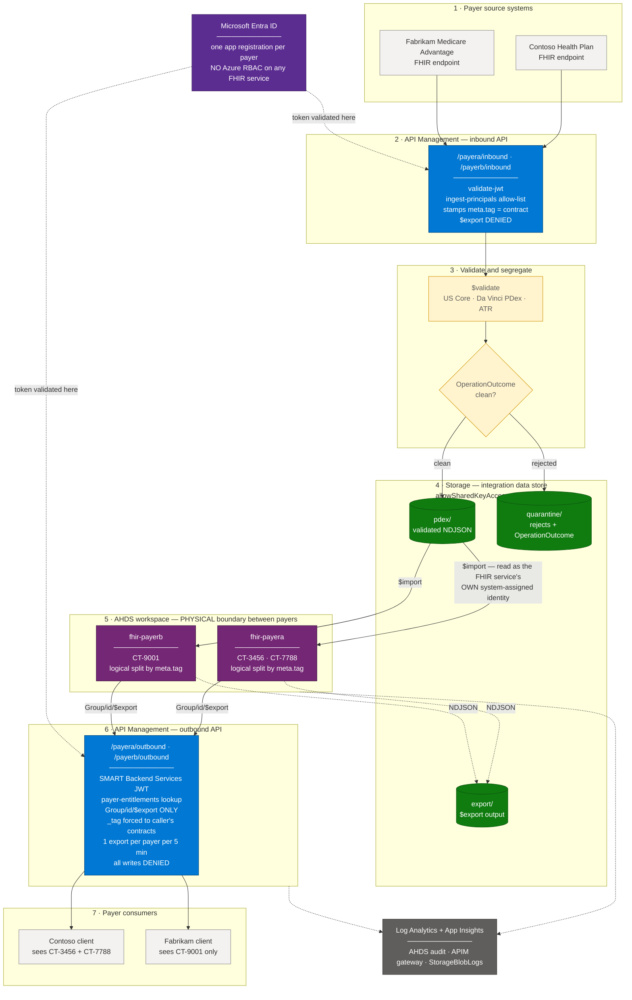
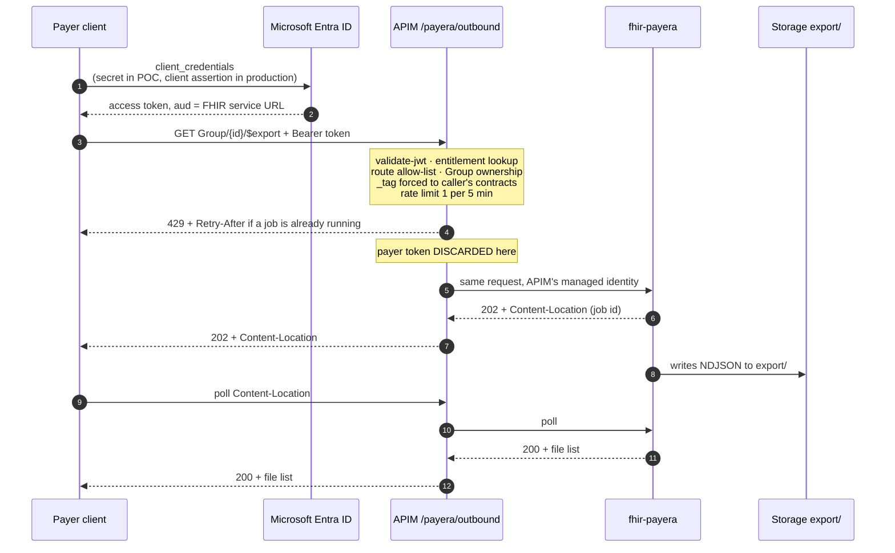

# AHDS FHIR — CMS-0057-F Payer Data Exchange Reference Implementation

A deployed, runnable Azure Health Data Services environment that proves per-payer PHI isolation for
CMS Interoperability and Prior Authorization (CMS-0057-F), together with the design decisions,
troubleshooting, quota/cost analysis and evidence behind it.

Everything here is **synthetic data only**. No PHI has been placed in any subscription referenced
in this repository.

### Read this first — every organisation name here is fictional

The payers, contracts and members in this repository are placeholders. Nothing below refers to a
real health plan, a real contract, or a real person.

| Placeholder | What it stands for | Where you will see it |
|---|---|---|
| **Contoso Health Plan** | fictional payer A | `fhir-payera`, `/payera/*` routes |
| **Fabrikam Medicare Advantage** | fictional payer B | `fhir-payerb`, `/payerb/*` routes |
| **Northwind Health** | fictional payer C — appears only in the "add a third payer" demo step | `DEMO-SCRIPT.md` |
| `CT-3456`, `CT-7788` | Contoso's two contracts — the pair that proves *logical* isolation within one payer | `meta.tag`, `_tag`, `Group` ids |
| `CT-9001` | Fabrikam's single contract — the one that proves *physical* isolation between payers | as above |
| `CT-5150` | Northwind's contract | demo step only |
| `payera` · `payerb` · `payerc` | **payer keys** — short slugs used consistently in FHIR service names, APIM route paths, entitlement lookups and resource id prefixes | everywhere |
| `group-ct3456`, `group-ct7788`, `group-ct9001` | the `Group` resources that scope every `$export` | `scripts/generate-samples.ps1` |
| `*.example.org` | member identifier systems | generated `Patient` / `Coverage` |
| `https://providence.org/fhir/contract` | the contract tag system URI — illustrative namespace, not a live endpoint | `meta.tag`, APIM policies |

Contoso, Fabrikam and Northwind are Microsoft's standard fictional company names, used in
documentation and samples precisely so that no real organisation is implied.

**The clinical data is machine-generated.** `Patient`, `Coverage` and `ExplanationOfBenefit`
resources are produced by [`scripts/generate-samples.ps1`](scripts/generate-samples.ps1) from a
fixed random seed, so every run is byte-identical and reproducible. No record bears any relation to
a real member, claim or encounter.

**Resource ids are namespaced `{payer}-{contract}-`** — for example
`payera-ct3456-pat-00001`. This is not cosmetic. `$import` preserves the `id` in the NDJSON
verbatim, so two payers both sending `Patient/12345` would silently overwrite each other. The
namespacing convention in the samples is the pattern production should follow.

**What is *not* fictional:** the Providence organisation name, the Azure resource names in
[docs/00-poc-environment.md](docs/00-poc-environment.md), and the two subscription GUIDs referenced
in the troubleshooting write-ups. Those are real, but the demo environment is deleted and
redeployed between sessions — treat them as illustrative rather than as running endpoints.

**Start here:** [00-EXECUTIVE-BRIEF.md](00-EXECUTIVE-BRIEF.md)

| If you want to | Read |
|---|---|
| Know whether the open asks are answered | [VALIDATION.md](VALIDATION.md) |
| Run the demo | [DEMO-SCRIPT.md](DEMO-SCRIPT.md) |
| Understand the design | [docs/01-architecture.md](docs/01-architecture.md) |
| Fix an `$import` 403 | [docs/04-import-403-rootcause.md](docs/04-import-403-rootcause.md) |
| Plan for 40 FHIR services | [docs/09-quota-and-cost-guidance.md](docs/09-quota-and-cost-guidance.md) |
| Onboard a payer | [runbooks/payer-onboarding.md](runbooks/payer-onboarding.md) |

---

## Repository map

```
00-EXECUTIVE-BRIEF.md        the read-first document
VALIDATION.md                every ask mapped to runnable evidence, plus the open gap
DEMO-SCRIPT.md               3-minute proof, or 25-minute walkthrough

docs/
  00-poc-environment.md           what was deployed, and the two tenant constraints
  01-architecture.md              component-by-component walkthrough
  02-architecture-decisions.md    every open design item, closed, with rationale
  03-platform-questions.md        the seven platform questions, answered
  04-import-403-rootcause.md      the $import 403: cause, fix, and how to retest correctly
  05-capacity-and-scale.md        the open question, framed for the product group
  06-smart-backend-services.md    SMART on FHIR backend services auth
  07-apim-control-plane.md        the six policy layers and why they are ordered that way
  08-cost-model.md                POC and production cost shape
  09-quota-and-cost-guidance.md   quota limits, request path, and the 40-instance cost answer

infra/
  main.bicep, main.bicepparam     the whole environment
  modules/                        ahds · apim · storage · keyvault · monitoring · rbac
  deploy.ps1

apim/policies/
  payer-inbound.xml               entitlement, tag enforcement, scope validation
  payer-outbound.xml              export serialisation, rate limiting, response filtering

scripts/
  generate-samples.ps1            synthetic FHIR NDJSON, namespaced ids, contract-tagged
  load-fhir-direct.ps1            loads via REST (see the constraint note below)
  run-import.ps1                  $import with the 403 diagnostics built in
  onboard-payer.ps1               the seven-step onboarding, scripted
  run-isolation-tests.ps1         the proof suite, executable
  show-env.ps1                    environment summary + a filled-in .http file

tests/isolation-proofs.http       the same assertions as raw HTTP
runbooks/                         payer-onboarding · import-troubleshooting
diagrams/                         editable .drawio (4 pages) + Mermaid
loadtest/run-loadtest.ps1         concurrent export measurement harness
graphify/                         knowledge-graph method for the engagement corpus
slides/build-deck.py              regenerates the deck; the deck itself is a build artifact
```

---

## The architecture in one paragraph

One **FHIR service per payer** inside an Azure Health Data Services workspace, fronted by **API
Management as a mandatory control plane**. Physical separation between payers, logical separation
between contracts within a payer via `meta.tag` / `_tag`. Payers authenticate as SMART on FHIR
**backend services** and are entitled at the gateway, not in the application. Bulk data moves in
through `$import` from an integration data store and out through **Group-scoped `$export` only** —
system-level and patient-level export return `403`. Adding a payer is one entry in a Bicep array
plus one script call; nothing is provisioned by hand, because at forty instances configuration
drift is the failure mode to design against.

### The architecture in one picture



| Colour | Meaning |
|---|---|
| 🟦 Blue | API Management — the enforcement points. Every rule that can be violated is enforced here. |
| 🟪 Purple | AHDS FHIR services — one per payer. The physical boundary. |
| 🟩 Green | Blob storage — the integration data store. Staging only; not a system of record. |
| 🟨 Amber | Validation and routing — the decision that determines whether data is ever persisted. |
| 🟫 Violet | Microsoft Entra ID — issues payer tokens but grants **no** data-plane authorisation. |
| ⬜ Grey | Systems outside the trust boundary — payer sources and payer consumers. |

Solid arrows are the data path. Dotted arrows are control and telemetry.
The editable source diagram — four pages, more detail — is
[diagrams/providence-ahds-reference-architecture.drawio](diagrams/providence-ahds-reference-architecture.drawio).

---

### Walking the diagram, block by block

#### 1 · Payer source systems — outside the trust boundary

Thirty to forty payers, ~150–200 contracts between them. They are *untrusted inputs*: nothing they
send is assumed to be conformant, correctly tagged, or free of id collisions. Two payers sending
`Patient/12345` is not a hypothetical — FHIR ids are payer-scoped by convention and global in
practice, so ids are namespaced by payer and contract before anything reaches a FHIR service.

#### 2 · API Management, inbound — where provenance is established

[`apim/policies/payer-inbound.xml`](apim/policies/payer-inbound.xml)

The ingest pipeline writes through this API, never directly to the FHIR service. Four things happen
here that cannot be undone later:

- **`validate-jwt`** against Entra, checked against the `ingest-principals` named value. Only
  Providence's own ingest identities pass; a payer credential presented here fails.
- **`meta.tag` is stamped server-side** from the `X-Providence-Contract` header. The payer does not
  get to assert its own contract tag — if it did, the entire logical isolation model would rest on
  the honesty of the party it is meant to constrain.
- **Writes require the contract header.** No header, no write.
- **`$export` is denied outright.** The inbound API is a write path; read operations belong on the
  outbound API with a different credential and a different policy stack.

`subscriptionRequired: false`. Authentication is the JWT, not an APIM subscription key — a second
credential type would be a second thing to rotate and revoke without adding a control.

#### 3 · Validate and segregate — the gate before persistence

`$validate` runs each resource against US Core, Da Vinci PDex and the ATR profiles. The
`OperationOutcome` decides the route: clean resources go to `pdex/`, rejects go to `quarantine/`
**with the OperationOutcome alongside them**, so a payer can be told exactly which field failed
which invariant rather than "your file was rejected".

This ordering matters. Validating *after* import means invalid data is already in the FHIR service
and has to be deleted; validating *before* means the service only ever contains conformant
resources. Multi-version IG validation is not supported server-side, which is why validation lives
in the pipeline rather than in AHDS — see [Q4 in docs/03-platform-questions.md](docs/03-platform-questions.md).

#### 4 · Storage — the integration data store

[`infra/modules/storage.bicep`](infra/modules/storage.bicep)

| Container | Contents |
|---|---|
| `pdex` | validated NDJSON ready for `$import` |
| `export` | `$export` output, read by APIM on the payer's behalf |
| `quarantine` | rejected resources plus their `OperationOutcome` |

**`allowSharedKeyAccess: false`** is the single most important line in this module. It forces
managed-identity authentication and removes the account-key workaround — which is exactly the
workaround that would have masked the `$import` 403 described below until production, where it
would have surfaced under deadline pressure.

Storage is staging, not a system of record. `pdex/` is write-once, read-once, and a lifecycle rule
should move it to Cool at 30 days and Archive at 90.

#### 5 · AHDS workspace and FHIR services — the physical boundary

[`infra/modules/ahds.bicep`](infra/modules/ahds.bicep)

One workspace, one `fhir-R4` service per payer. Three settings carry the weight:

| Setting | Value | Why |
|---|---|---|
| `identity.type` | `SystemAssigned` | This is the identity `$import` actually uses to read blobs. Set it explicitly — an implicitly-created principal is how the dev environment reached a state nobody could explain. |
| `resourceVersionPolicy` | `versioned` | Gives resource history through `_history` — the closest available answer to the transaction-log question. |
| `importConfiguration.enabled` | `true` | With `initialImportMode: false`. Initial mode is faster but makes the service read-only for the duration of the job. |

**Why the hard boundary is at the payer and not the contract.** Physical separation limits the blast
radius of a *mistake*; logical separation limits the result set of a *query*. They are not
substitutes. A defect in an APIM policy could expose `CT-3456` to a caller entitled only to
`CT-7788` — both Contoso's own data, a contained incident. The same defect **cannot** expose
Contoso's data to Fabrikam, because Fabrikam's credential has no authorisation path to
`fhir-payera` at all. Put the unrecoverable boundary where the PHI-sharing agreement sits. That is
what makes ~40 instances defensible where ~200 would not be.

It is also the best-performing option under burst load, because one payer's export traffic is not
another payer's problem.

#### 6 · API Management, outbound — the trusted broker

[`apim/policies/payer-outbound.xml`](apim/policies/payer-outbound.xml) ·
[docs/07-apim-control-plane.md](docs/07-apim-control-plane.md)

Six policy layers, in this order, and the order is the design:

| # | Layer | What it prevents |
|---|---|---|
| 1 | `validate-jwt` | anonymous or forged callers |
| 2 | Entitlement lookup (`payer-entitlements`) | a valid payer reaching another payer's route |
| 3 | Route allow-list | `GET` only; every write verb returns `403` |
| 4 | Group-scope enforcement | system-level and patient-level `$export`; the working set is bounded by cohort size, not by the 800,000-patient population |
| 5 | **Forced `_tag`** | a caller widening its own query — the `_tag` filter is *overwritten*, not merged, so a supplied `_tag` cannot broaden the result set |
| 6 | Rate limit | one export job per payer per five minutes; a synchronised burst becomes a queue instead of a retry storm |

Then the part that makes the whole model hold:

> **The payer's token is validated and then discarded.** APIM calls AHDS with its *own* managed
> identity. The FHIR service never makes a payer-specific authorisation decision, and the payer's
> credential never reaches it.

#### 7 · Payer consumers — and why the gateway cannot be bypassed

Each payer has one Entra app registration and **zero Azure RBAC role assignments on any FHIR
service**. [`infra/modules/rbac.bicep`](infra/modules/rbac.bicep):

| Principal | Role | Scope |
|---|---|---|
| Each FHIR service's **system-assigned** identity | Storage Blob Data Contributor | storage account |
| APIM's system-assigned identity | FHIR Data Contributor | each FHIR service |
| APIM's system-assigned identity | Storage Blob Data Reader | storage account |
| Operator | FHIR Data Contributor + Storage Blob Data Contributor | both |
| **Payer applications** | **nothing** | — |

The last row *is* the security model. A payer that discovers the FHIR service URL and calls it
directly with a valid Entra token gets `403` from Azure RBAC before any policy runs. The gateway is
not a convention or a firewall rule — it is the only route that exists. This is what
`run-isolation-tests.ps1` proves, and it is asserted from the payer's own credential rather than
from an operator token.

#### Observability — cross-cutting

[`infra/modules/monitoring.bicep`](infra/modules/monitoring.bicep)

AHDS audit logs, APIM gateway logs, `StorageBlobLogs` and Application Insights all land in one Log
Analytics workspace. `StorageBlobLogs` earns its place specifically because it is what distinguishes
a *live* 403 from a *replayed* one — see the `$import` section below. FHIR services accept only the
`allLogs` category group; `audit` is rejected with `BadRequest`, which is worth knowing before a
deployment fails on it.

---

### The outbound request, end to end



### The inbound request, end to end

```
payer source → APIM /{payer}/inbound → $validate → clean?
                                          ├── yes → pdex/  → $import → AHDS FHIR
                                          └── no  → quarantine/ + OperationOutcome
```

Two properties of `$import` that have caught people out, both of which shape the pipeline above:

- **`$import` does not run APIM policies.** It reads NDJSON straight from blob storage. `meta.tag`
  must already be in the file — which is why it is stamped at step 2, not at import time.
- **`$import` preserves resource ids verbatim.** Two payers sending `Patient/12345` overwrite each
  other silently, with no error. Namespace ids by payer and contract before import.

And the identity property that cost this engagement two days:

- **`$import` reads blobs as the FHIR service's *own* system-assigned principal** — not as any
  user-assigned managed identity attached to the service. Full write-up below.

---

Full walkthrough: [docs/01-architecture.md](docs/01-architecture.md).
Decision record: [docs/02-architecture-decisions.md](docs/02-architecture-decisions.md).
Policy stack in detail: [docs/07-apim-control-plane.md](docs/07-apim-control-plane.md).

---

## Reproducing the environment

```powershell
cd infra
az deployment group create -g <your-rg> -f main.bicep -p main.bicepparam

cd ..
./scripts/generate-samples.ps1 -PatientsPerContract 25
./scripts/load-fhir-direct.ps1                 # or ./scripts/run-import.ps1
./scripts/onboard-payer.ps1 -PayerKey payera -DisplayName 'Contoso Health Plan' -Contracts CT-3456,CT-7788
./scripts/onboard-payer.ps1 -PayerKey payerb -DisplayName 'Fabrikam Medicare Advantage' -Contracts CT-9001
./scripts/run-isolation-tests.ps1
```

`run-isolation-tests.ps1` is the proof: it mints an ephemeral payer credential, asserts that Payer A
cannot read Payer B's data by any route, and revokes the credential inside one process. Last full
run: **16 / 16 pass**.

Adding a payer is one entry in the `payers` array in
[infra/main.bicepparam](infra/main.bicepparam) plus one `onboard-payer.ps1` call.

> The APIM policy files are not strict-XML parseable — expressions such as
> `@(context.Variables["payerKey"])` embed unescaped double quotes inside attributes. This is how
> APIM stores them; `format: 'rawxml'` accepts it and the deployed policy matches these files byte
> for byte. **Do not "fix" the quotes.**

---

## The `$import` 403 — what we learned

The most expensive lesson of the engagement, and the one most likely to recur at scale. Full
write-up with KQL, CLI and retest procedure: [docs/04-import-403-rootcause.md](docs/04-import-403-rootcause.md).

### The symptom

`$import` accepted the job with `202`, then the poll returned `403 — Failed to get properties of
blob`. Storage Blob Data Contributor **was** assigned. An earlier job had succeeded. It looked like
a regression.

### The root cause

The role was on the wrong identity.

> **AHDS `$import` reads the integration data store as the FHIR service's *own* service principal —
> not as a user-assigned managed identity attached to the service.**

| | |
|---|---|
| Identity that **held** the role | a user-assigned managed identity |
| Identity that **made the request** | the FHIR service's own enterprise application, named `<workspace>/fhirservices/<service>` |

Attaching a UAMI and granting it storage access changes nothing about which identity performs the
blob read. The naming is what makes this hard to spot: the enterprise application is named after the
FHIR service, so it reads like a description of a resource rather than a security principal you must
grant a role to.

### The fix

[`infra/modules/rbac.bicep`](infra/modules/rbac.bicep):

```bicep
resource importExportGrant 'Microsoft.Authorization/roleAssignments@2022-04-01' = [for (pid, i) in fhirPrincipalIds: {
  scope: storage
  name: guid(storage.id, pid, storageBlobDataContributor)
  properties: {
    roleDefinitionId: subscriptionResourceId('Microsoft.Authorization/roleDefinitions', storageBlobDataContributor)
    principalId: pid                      // the FHIR service's SYSTEM-ASSIGNED principal
    principalType: 'ServicePrincipal'
  }
}]
```

`principalType: 'ServicePrincipal'` is not decorative — without it ARM may evaluate the assignment
before Entra has replicated the principal and fail with `PrincipalNotFound`.

### The follow-up that looked like the fix had failed

After the fix, a **new** file imported successfully while the **previously tested** file still
returned `403` — same poll URL, and no `GetBlobProperties` request reaching storage at all.

That last detail is the whole answer. **An import job is immutable once terminal.** Polling a
completed job replays the `OperationOutcome` persisted when it finished; it is a stored record, not
a re-evaluated authorisation decision. Storage sees nothing because no blob read occurs.

| | Live 403 | Replayed 403 |
|---|---|---|
| `StorageBlobLogs` in the last 5 min | a `GetBlobProperties` row, `403`, with the calling object id | **nothing** |
| Response body | may vary | byte-identical every time |

```kusto
StorageBlobLogs
| where TimeGenerated > ago(15m)
| where StatusCode == 403
| project TimeGenerated, OperationName, Uri, RequesterObjectId, AuthenticationType
```

An empty result while `$import` returns `403` means the 403 is replayed, not live. **Never retest by
re-polling** — copy the NDJSON to a new blob path, POST a fresh `$import`, and confirm the returned
job id differs. Implemented as `-Force` in [`scripts/run-import.ps1`](scripts/run-import.ps1).

### The general rule

> **Three different identities can be involved in a single `$import`, and granting the wrong one
> produces a 403 that looks identical to granting nothing at all.**

| Identity | Needs | Failure position |
|---|---|---|
| The **caller** submitting `$import` | FHIR Data Contributor / Importer on the FHIR service | `403` **on the POST** |
| The **FHIR service** reading blobs | Storage Blob Data Contributor on the storage account | `403` **on the poll** |
| A **UAMI** attached to the service | nothing, for `$import` | grants have no effect |

Whether the 403 lands on the submit or on the poll tells you which identity to look at. That is the
fastest available diagnostic, and it is built into the error handling in `run-import.ps1`.

### Preventing the recurrence

1. **Never grant storage access to a UAMI for `$import` and assume it applies.** It does not.
2. **Set `identity.type: 'SystemAssigned'` explicitly in IaC.** Never toggle system-assigned identity
   off and on — the `principalId` changes and every existing role assignment silently stops working.
3. **Keep the role assignment in the same template as the FHIR service.** Split across templates or
   done by hand, it drifts. At forty instances, it *will* drift.
4. **Disable shared-key access on storage** (`allowSharedKeyAccess: false`, set in
   [`infra/modules/storage.bicep`](infra/modules/storage.bicep)). It removes the tempting workaround
   that hides the real problem until production.
5. **Monitor on job id, not blob path**, and add a 90-second `$import` smoke test of a single-row
   NDJSON after every environment change.

---

## Scaling to 40 FHIR services — quota and cost

Full detail, with the request path and the published rate card:
[docs/09-quota-and-cost-guidance.md](docs/09-quota-and-cost-guidance.md).

### You may not need a quota request

| Quota | Default | Maximum | **Scope** |
|---|---|---|---|
| Workspaces | 10 | contact support | **per subscription** |
| FHIR services | 10 | contact support | **per workspace** |
| DICOM / MedTech services | 10 | contact support | per workspace |

The FHIR limit is **per workspace**, not per subscription.

> **4 workspaces × 10 FHIR services = 40 services in one subscription, with no quota request.**

Only 40 services in a *single* workspace needs a ticket. Also plan for the **4 TB default storage
limit per FHIR service** (raisable to **100 TB** via the same ticket type) — per-payer separation
keeps every instance far below it, while a consolidated design at ~1.4 TB would approach it.

### Raising the request

Azure portal → **Help + Support** → **Create a support request** → issue type **Service and
subscription limits (quotas)** → quota type **Azure Health Data Services**. Supply subscription ID,
region, workspace name(s), current and requested limits, and business justification. One request per
subscription — dev, QA and prod each need their own. Free and trial subscriptions are not eligible.
**Quota requests are free of charge**; no support plan is required.

**Processing time:** Microsoft publishes no SLA. Straightforward increases within existing regional
capacity are typically a few business days; anything requiring regional capacity validation takes
longer. Submit before it becomes blocking.

### Cost does not scale with instance count

AHDS FHIR is **consumption-billed** — no per-instance charge, no hourly runtime fee, no provisioned
capacity to buy up front. The same data volume and the same request volume cost approximately the
same whether they sit in 1 service or 40.

| Meter | Free allotment | Rate above |
|---|---|---|
| Structured storage | 1 GB / month | **$0.39 / GB / month** |
| BLOB storage | 1 GB / month | $0.023 / GB / month |
| API requests | 50,000 / month | **$0.54 / 100,000** |
| Export batch | first 1 GB | $0.19 first GB, then $0.14 / GB |
| FHIR transformations | 0.5 GB | $1.14 / GB |
| Structured de-identification | 0.5 GB | $1.14 / GB |
| Events | 100,000 | $0.59 / 1,000,000 |

Two details that matter for a CMS-0057-F backfill: **initial-mode `$import` does not incur a
charge**, and requests returning `429` or `5xx` are **not billed** — throttled retries do not
accumulate cost.

**What *does* scale with instance count** is the footprint around the service: private endpoints,
storage accounts, Log Analytics ingestion and APIM capacity are all per-instance. At 40 services
that is where the real delta appears, and it is an **operational** cost rather than a licensing one.

---

## Capacity — the one open question

Quota is not capacity. There is **no published concurrency ceiling** for AHDS FHIR and no
customer-facing concurrency setting; autoscale is free and reacts in roughly a minute, which is fine
for a ramp and useless for a step change. Forty payers submitting `Group/$export` inside the same
few seconds all get throttled while capacity spins up, and naive retry logic turns one spike into a
sustained overload.

Mitigations already in the template:

- **Export serialisation per payer** — one export job per payer per five minutes, enforced at the
  gateway in [`apim/policies/payer-outbound.xml`](apim/policies/payer-outbound.xml). A second
  submission gets `429` with `Retry-After` and never consumes FHIR capacity.
- **Group-scoped exports only** — the working set is bounded by cohort size, not by the whole
  population.
- **Physical separation as a bulkhead** — one payer's export load is not another payer's problem.
- **Backoff obligations in the payer onboarding contract**, not in a wiki.

What is still missing is a **number**. [`loadtest/run-loadtest.ps1`](loadtest/run-loadtest.ps1)
drives concurrent Group exports at increasing parallelism and records p95/p99 latency, 429 rate and
autoscale reaction time. Recommended sequence: 1 → 5 → 15 → 40 concurrent exports, then 40 exports
plus a concurrent `$import`. Details, and the questions to put to the product group, are in
[docs/05-capacity-and-scale.md](docs/05-capacity-and-scale.md).

**Run the load test before committing to a production date.** The architecture is right and the
isolation model is proven; capacity is the one variable that cannot be reasoned about from first
principles.

---

## Knowledge graph

[`graphify/`](graphify/) holds the method used to index the engagement corpus — 132 files,
~283,000 words → **930 nodes, 1,441 edges, 43 communities** — into a deterministic knowledge graph,
so that "where was that decided, and what depends on it?" is answerable structurally rather than by
search.

Only the method and the extraction contract are committed here. The generated artifacts from the
original run embed text from internal working notes and email threads that are not part of this
repository; rebuild locally against this repo to get a clean, scoped graph. See
[graphify/README.md](graphify/README.md).

---

## Cost control for the POC itself

**There is no pause button on AHDS FHIR.** Delete the resource group between sessions and redeploy
from `infra/main.bicep`; the whole environment rebuilds in about 20 minutes and APIM is the only
slow part.

```powershell
az group delete -n <your-rg> --yes --no-wait
```

Breakdown: [docs/08-cost-model.md](docs/08-cost-model.md). Two tenant governance constraints on the
demo subscription shaped how the scripts work — they do not reflect the architecture and will not
apply in your own subscription, but they are documented in
[docs/00-poc-environment.md](docs/00-poc-environment.md) rather than hidden.

---

## Reference documentation

| Topic | Link |
|---|---|
| Azure Health Data Services quotas and limits | https://learn.microsoft.com/azure/azure-resource-manager/management/azure-subscription-service-limits#azure-health-data-services |
| Health Data Services pricing | https://azure.microsoft.com/pricing/details/health-data-services/ |
| Pricing calculator | https://azure.microsoft.com/pricing/calculator/?service=health-data-services |
| Requesting a quota increase in the portal | https://learn.microsoft.com/azure/quotas/quickstart-increase-quota-portal |
| FHIR service — supported features | https://learn.microsoft.com/azure/healthcare-apis/fhir/fhir-features-supported |
| Bulk import (`$import`) | https://learn.microsoft.com/azure/healthcare-apis/fhir/import-data |
| Configure import settings | https://learn.microsoft.com/azure/healthcare-apis/fhir/configure-import-data |
| Bulk export (`$export`) | https://learn.microsoft.com/azure/healthcare-apis/fhir/export-data |
| Configure export settings | https://learn.microsoft.com/azure/healthcare-apis/fhir/configure-export-data |
| SMART on FHIR in AHDS | https://learn.microsoft.com/azure/healthcare-apis/fhir/smart-on-fhir |
| Azure RBAC for the FHIR service | https://learn.microsoft.com/azure/healthcare-apis/configure-azure-rbac |
| FHIR service diagnostic logs | https://learn.microsoft.com/azure/healthcare-apis/fhir/fhir-service-diagnostic-logs |
| Storage Blob Data Contributor role | https://learn.microsoft.com/azure/role-based-access-control/built-in-roles#storage-blob-data-contributor |
| API Management policy reference | https://learn.microsoft.com/azure/api-management/api-management-policies |
| CMS Interoperability and Prior Authorization final rule (CMS-0057-F) | https://www.cms.gov/priorities/key-initiatives/burden-reduction/interoperability/policies-and-regulations/cms-interoperability-and-prior-authorization-final-rule-cms-0057-f |
| Da Vinci PDex implementation guide | https://hl7.org/fhir/us/davinci-pdex/ |
| US Core implementation guide | https://hl7.org/fhir/us/core/ |

---

## Scope and disclaimer

Synthetic data only; no PHI. The POC network posture is public endpoints with no private endpoints
or VNet integration — production requires both, and that gap is configuration rather than
architecture. Pricing figures are East US, USD, accurate as of 2026-08-17; verify current rates
before quoting externally. This is a reference implementation shared for design discussion, not a
supported Microsoft product.
